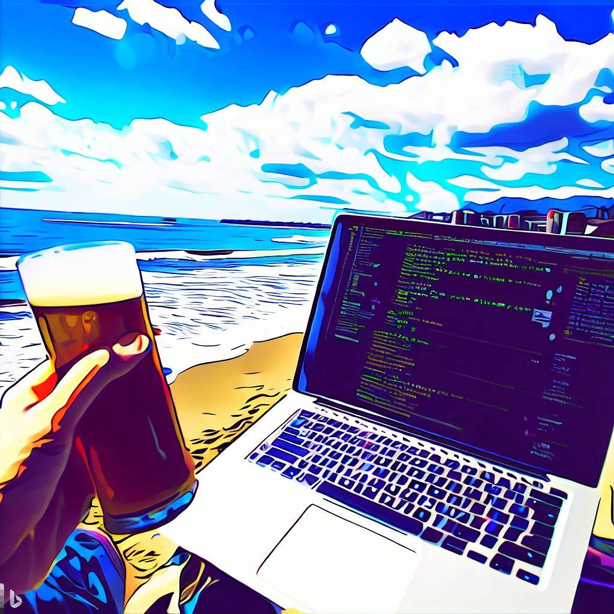

# ShoCode: Agentic Coding on the Coast

> A community-powered, fully bilingual (日本語 / English) one-day event for
builders, creators, and doers exploring the frontier of agentic coding —
held in the inspiring Shonan area of Kanagawa, Japan.

This repository is your single source of truth for event details, registration,
and community contributions. True to its roots, ShoCode uses GitHub to manage
every aspect of the event — including registration, which happens through a
pull request (with easier paths available for those new to PRs).

## The Event

The Shonan Code Summit (ShoCode) is a one-day, repeatable gathering where
engineers come together to **build, present, and demo** around the theme of
**Agentic Coding** — AI agents that write, review, test, deploy, and evolve
code alongside humans.

* **Location:** TBD (Shonan area, Kanagawa, Japan)
* **Date:** TBD
* **Cost:** TBD (goal is to keep it affordable and accessible)
* **Languages:** Japanese and English (fully bilingual)

### Format

The day is split into three acts:

1. **Presentations** — Deep-dive talks on agentic coding: autonomous agents,
   human-in-the-loop workflows, AI-assisted architecture, prompt engineering
   for code generation, and more.
2. **Hackathon** — Hands-on building time. Bring a project idea or join a team
   on-site. Build something real with agentic tools and techniques.
3. **Hackathon Demos** — Teams show what they built. Live demos, feedback, and
   celebration of what's possible when humans and agents code together.

### What We Value

* **Builders, creators, doers.** This event is for people who make things.
* **Technical depth and honesty.** No marketing pitches, no investor decks, no
  recruiting talks.
* **Community first.** Sponsors are welcome in appropriate ways, but this is not
  a corporate event. It belongs to the community.
* **Bilingual by design.** Presentations and materials in both Japanese and
  English. Use whichever you're comfortable with.

## Shonan Area

What sets ShoCode apart is its location in the Shonan area of Kanagawa, Japan.
With views of Mount Fuji across Sagami Bay, ocean breezes, and the relaxed
energy of the coast, you'll find inspiration beyond the screen. Enjoy local
beaches, trails, cafés, and the unmistakable vibe of Shonan before or after
the event.

<figure>
  
  <figcaption>Created by DALL-E</figcaption>
</figure>

## How to Attend

Register by submitting a **profile page** to this repository. There are two
ways to do it — pick whichever suits you:

### Option 1: Pull Request (classic ShoCode style)

1. Read the **[Creative Commons LICENSE](LICENSE)**.
2. **Fork this repository.**
3. Create a new folder under `profiles/` named after your GitHub username
   (e.g., `profiles/your_username`).
4. Add your profile page as a Markdown file. Use
   [profiles/template.md](profiles/template.md) as a starting point.
   A [Japanese template (日本語テンプレート)](profiles/template_jp.md) is also
   available — use whichever language you prefer.
5. **Submit a Pull Request** from your fork to this repository.

### Option 2: Ask Copilot (the agentic path 🤖)

Comment on an open registration issue with your details and ask **@copilot** to
create the PR for you. Copilot will generate your profile page and submit the
PR on your behalf. This is registration-as-agentic-coding — fitting for a
conference about AI agents that write code alongside humans.

---

### Profile Page Requirements

Your profile page should include:

* **About you** — name, GitHub username, and a public way to contact you
  (Twitter/X, LinkedIn, Bluesky, LINE, etc.)
* **What you'll bring** — a short description of what you want to present,
  build, or demo. Focus on agentic coding, AI-assisted development, or related
  technical topics.
* **Code or project links** — share repos, gists, blogs, or prior work that
  shows what you're about
* **Your preferred role:**
  * Presenter — give a talk during the presentation block
  * Hacker — participate in the hackathon (and demo what you build)
  * Both — present and hack
  * Attendee — come, learn, and connect

Once your PR is reviewed and merged, you're in. Welcome to ShoCode!

## Contributing to ShoCode

This event belongs to the community. We welcome contributions of all kinds —
event ideas, tooling, documentation, translations, and more. Before
contributing, please review the [Code of Conduct](CODE_OF_CONDUCT.md) and
the [Contribution Guidelines](CONTRIBUTING.md).
