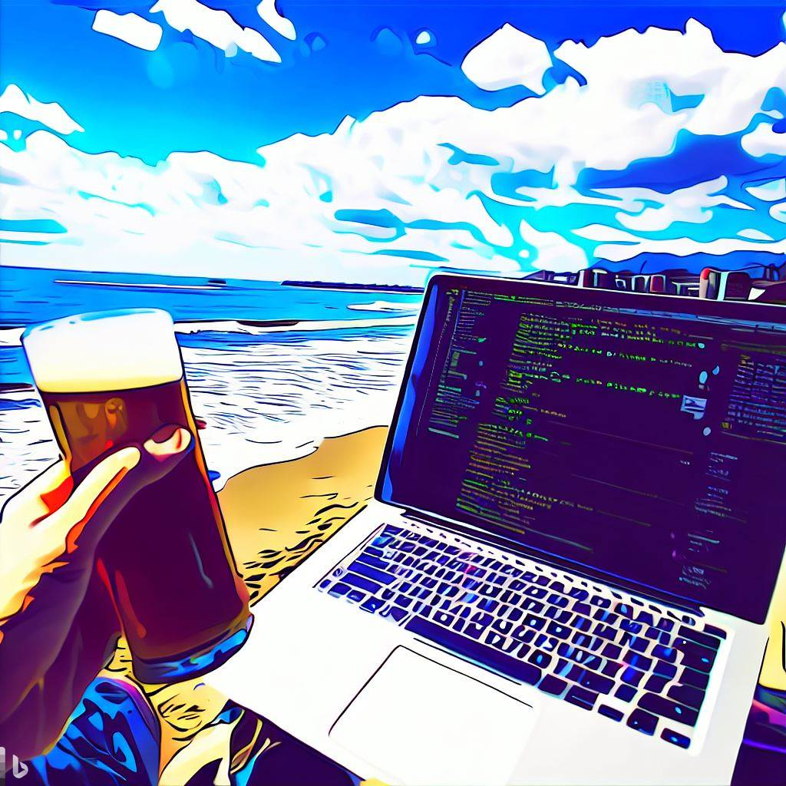

# Shonan Code Summit: Innovating the Future

> A collaborative, community-powered tech summit for innovative engineers to
share knowledge and shape the future of software development.

This is your one-stop source for all event details, venue information,
logistics, and costs. As an innovative technical event, we will be using
GitHub to manage every aspects of the summit, including the submission of your
self-introduction (bio) page, which also doubles as registration.

## The Summit

Join us for an unforgettable one-day event, the Shonan Code Summit (ShoCode),
focused on exploring and exchanging cutting-edge ideas and knowledge in the
world of software engineering and architecture. Our goal is to bring together
the finest engineers who are passionate about creating a brighter future for
developers and enhancing their professional fulfillment, and together, we will
push the boundaries of innovation and design.

* Location: TBD (Hayama, Japan)
* Date: TBD (August/September, 2023)
* Cost: TBD (goal is under 10,000yen)

At the heart of this event, we have a unique and engaging format:

1. Engineers will submit a self-introduction page (bio) showcasing their deep
   technical insights, concepts, code, and so on.
1. Contributors who submit engaging and insightful activities and knowledge
   will have the opportunity to present as speakers.
1. Attendees will have the chance to share their technical knowledge in shorter
   "speed-dating" type sessions, fostering dynamic and rapid exchanges of ideas.
1. Ample opportunities for networking, collaboration, and discussions will be
   provided throughout the day.

Key requirements for the presentations include:

1. A strong focus on technical depth and innovation
1. Vendor-neutral content (no marketing)
1. Inclusion of reusable code (programming language, scripts, or
   configuration/infrastructure as code)

## Shonan Area

What sets this event apart is its stunning location in Hayama, Japan. With
breathtaking views of Mount Fuji across Sagami Bay, you'll be inspired as you
immerse yourself in the beauty of this seaside town. Along with participating
in the event, enjoy a variety of local activities, including marine sports,
mountain trails, shopping, and dining.

Don't miss this incredible opportunity to connect with like-minded engineers,
learn from industry leaders, and contribute to shaping the future of software
development and architecture. Share this invitation with fellow engineers and
let's create the ultimate future together at the Shonan Code Summit (ShoCode)!

<figure>
  
  <figcaption>Created by DALL-E</figcaption>
</figure>

## How to Attend

Follow the instructions below to submit your **self-introduction page (bio)**
and register for the event using GitHub:

> Submitting a bio page using GitHub and the pull request process ensures that
our attendees are part of our target audience with a passion for sharing
knowledge. It also creates a sense of community by associating the submissions
with the attendees' public GitHub profiles.

### Self-introduction Page (bio) Submission and Registration

1. Read the **[Creative Commons LICENSE](LICENSE)** before contributing to the
   ShoCode repository.
2. **Fork this repository** to create your own copy of the ShoCode repository.
3. In your forked repository, **create a new folder** under `papers` named
   after your GitHub username (e.g., **`papers/your_username`**).
4. Inside the folder you created, **add your "self-introduction page"** as a
   Markdown file. Use [papers/template.md](papers/template.md) as a starting
   point. Make sure your "self-introduction page" meets the following
   requirements:

    * The page should be in English (use of machine translation is allowed)
    * Length should be under 2000 words
    * Focus on technical depth and innovation
    * Vendor-neutral content (no marketing)
    * Include some reusable code (programming language, scripts, or
        configuration/infrastructure as code)

5. At the bottom of the page, provide the following information:

    * Your name and social media details
    * We need at least one way to contact you (twitter, Facebook, LINE, etc)
    * A brief abstract of your page
    * Your preference for attending the event:
      * Participate as a session speaker
      * Participate in the "speed-dating" rounds
      * As a participant, just publish my self-introduction page on this event
          repository

6. Once you have completed steps 1-5, **submit a Pull Request** from your
   forked repository to the main ShoCode repository. Your Pull Request will act
   as your page submission and event registration.
7. The event maintainers will **review your Pull Request**. They may provide
   feedback or request changes to your page or submission details.
8. Once your Pull Request is **accepted and merged**, your attendance at the
   Shonan Code Summit is confirmed. Congratulations!

We look forward to your participation in the Shonan Code Summit (ShoCode)
and can't wait to see the incredible ideas and insights you'll bring to the
event!

## Contributing to ShoCode

We welcome your feedback and contributions to the Shonan Code Summit (ShoCode).
Before making contributions, please review the
[Code of Conduct](CODE_OF_CONDUCT.md) and the
[Contribution Guidelines](CONTRIBUTING.md).
