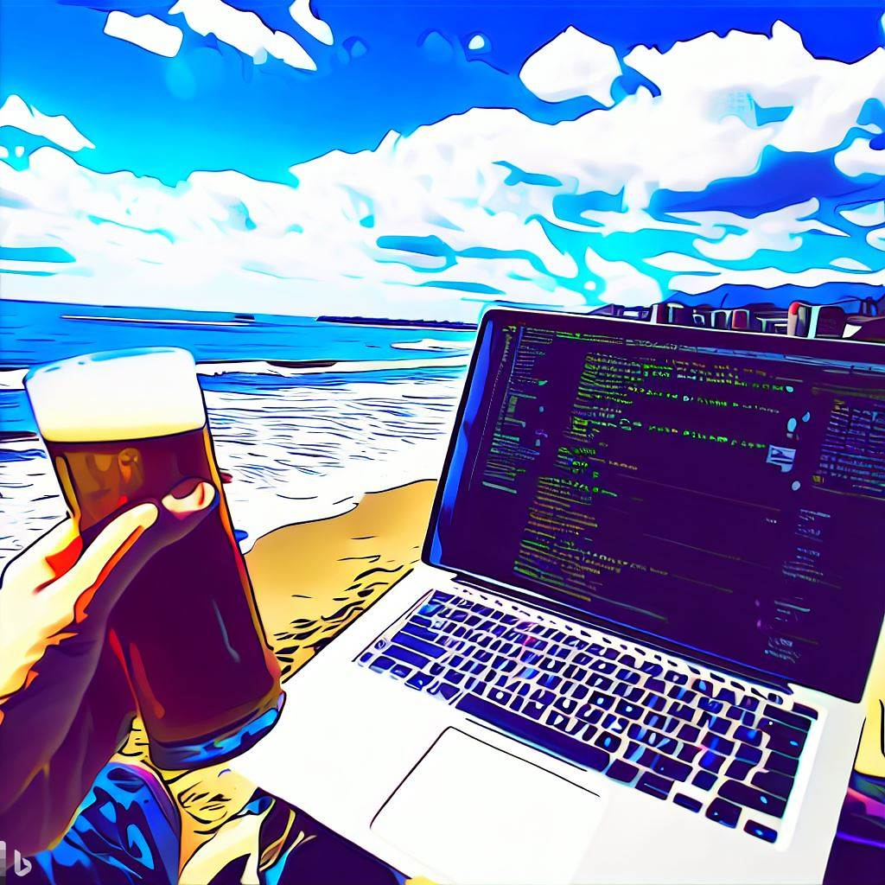

# Shonan Code Summit : Innovating the Future

> 革新的なエンジニアが知識を共有し、ソフトウェア開発の未来を形作るための、コミュニティ主導のコラボレイティブな技術サミットです。

このリポジトリは、イベントのすべての詳細、会場情報、ロジスティクス、および参加費用のワンストップ情報源です。革新的な技術イベントとして、GitHub を使用して、参加登録を兼ねた自己紹介ページの提出など、サミットのあらゆる側面を管理します。

## The Summit

ソフトウェア エンジニアリングとアーキテクチャの世界における最先端のアイデアと知識を探求し、情報交換することに焦点を当てた忘れられない 1 Day イベント、Shonan Code Summit (ShoCode) にご参加ください。私たちの目標は、開発者のより明るい未来を創造し、専門的な充実感を高めることに情熱を傾ける最高のエンジニアを集めることであり、共にイノベーションとデザインの境界を押し広げます。

* 場所: 未定 (葉山, 日本)
* 日程: 未定 (2023 年 8 月 - 9 月を目標)
* 参加費用: 未定 (¥10,000 以内を目標)

このイベントの中心にあるのは、ユニークで魅力的な開催形式です。

1. エンジニアは、彼らの深い技術的洞察、概念、およびコード等を紹介する **自己紹介ページ (BIO)** を提出します。
1. 魅力的で洞察に満ちた活動やナレッジを提出した参加者は、スピーカーとして発表する機会を得られます。
1. 参加者は、短い「スピードデート」タイプのセッションでナレッジを共有する機会があり、ダイナミックで迅速なアイデアの交換が促進されます。
1. ネットワーキング、コラボレーション、およびディスカッションのための十分な機会が 1 日を通して提供されます。

プレゼンテーションの主な要件は次のとおりです。

1. 技術の深さと革新への強いフォーカス
1. ベンダー中立のコンテンツ (マーケティングなし)
1. 再利用可能なコード (プログラミング言語、スクリプト、またはコードとしての構成/インフラストラクチャ) の組み込み

## 湘南エリア

このイベントを際立たせているのは、日本の葉山という素晴らしいロケーションです。相模湾越しに息をのむような富士山の景色を眺めながら、この海辺の町の美しさに浸ると、インスピレーションを得ることができます。イベントに加えて、マリンスポーツや登山道、ショッピングやグルメなど、地域ならではのアクティビティもお楽しみください。

志を同じくするエンジニアとつながり、業界のリーダーから学び、ソフトウェア開発とアーキテクチャの未来を形作ることに貢献できるこの素晴らしい機会をお見逃しなく。 この招待状を仲間のエンジニアと共有し、Shonan Code Summit (ShoCode) で一緒に究極の未来を作りましょう！

*Created by DALL-E*

## 参加方法

以下の手順にしたがって **自己紹介ページ (BIO)** を提出し、GitHub を使用してイベントに参加登録してください。

> GitHub、および Pull request プロセスを使用した自己紹介ページを提出することで、参加者は知識を共有することに情熱を持っているターゲット オーディエンスの一部であることが保証されます。また、提出物を出席者の公開 GitHub プロファイルに関連付けることで、コミュニティの感覚を生み出します。

### 自己紹介ページ (BIO) の提出と参加登録

1. ShoCode リポジトリに貢献する前に **[Creative Commons LICENSE](LICENSE)** をお読みください。
1. **このリポジトリをフォーク**して、ShoCode リポジトリの独自のコピーを作成します。
1. フォークしたリポジトリの `papers` の下に GitHub ユーザー名と同じ名前の **新しいフォルダーを作成します** (例: **`papers/your_username`**)。
1. [papers/template.md](papers/template.md) を参考にして、作成したフォルダー内に**自己紹介ページを Markdown ファイルとして追加します**。自己紹介ページが次の要件を満たしていることを確認してください。
   - 自己紹介ページは英語である必要があります (機械翻訳の使用はOKです)
   - 長さは 2000 語以内である必要があります
   - ベンダー中立のコンテンツ (マーケティングなし) とします
   - 技術的な深さと革新に焦点を当てた、以下のいずれかの内容を記載します
     - 再利用可能なコード (プログラミング言語、スクリプト、またはコードとしての構成/インフラストラクチャ)
     - 主なアイデア、技術的洞察、イノベーションを強調する論文
     - いずれかの OSS への貢献。(リポジトリへのリンクなどを記載)
     - これまでの技術イベントでの講演内容などの情報
     - あなたが執筆した書籍、メディア記事、ブログなどの URL
     - その他、このイベントに貢献できる方法 (運営への貢献、イベントへのアイディアなど)

1. ページの最後に、次の情報を記入してください。
   - あなたの氏名とソーシャル メディアの詳細
   - 少なくとも 1 つの連絡方法 (Twitter、Facebook、LINE など)
   - イベント参加における希望:
     - セッションスピーカーとして参加したい
     - "スピードデート" ラウンドに参加したい
     - 参加者として、このリポジトリで自己紹介ページを公開するのみ
1. ステップ 1 - 5 を完了したら、フォークしたリポジトリからメインの ShoCode リポジトリに **Pull Request を送信します**。Pull Request は、自己紹介ページの提出とイベント登録の役割を果たします。
1. イベント メンテナーが **あなたの Pull Request をレビュー** します。メンテナーは、フィードバックを提供したり、提出物の詳細の変更を要求したりする場合があります。
2. Pull Request が **受け入れられてマージ** されると、Shonan Code Summit への参加が確定します。おめでとうございます！

Shonan Code Summit (ShoCode) への皆様のご参加をお待ちしております。皆様がイベントにもたらす素晴らしいアイデアや洞察を楽しみにしています！

## ShoCode への貢献

Shonan Code Summit (ShoCode) へのフィードバックと貢献を歓迎します。 貢献を行う前に、[行動規範](CODE_OF_CONDUCT.md) と [貢献ガイドライン](CONTRIBUTING.md) を確認してください。
